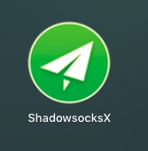
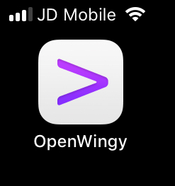
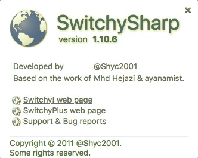
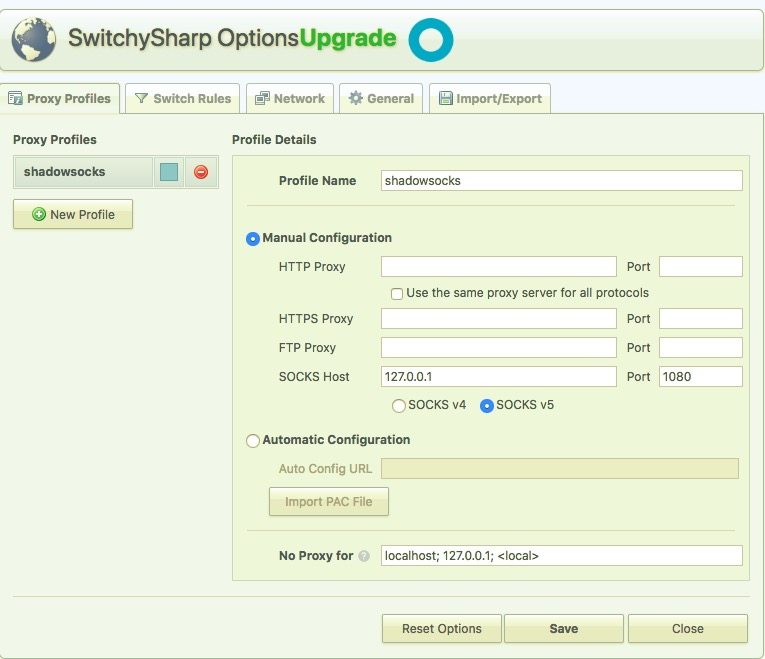
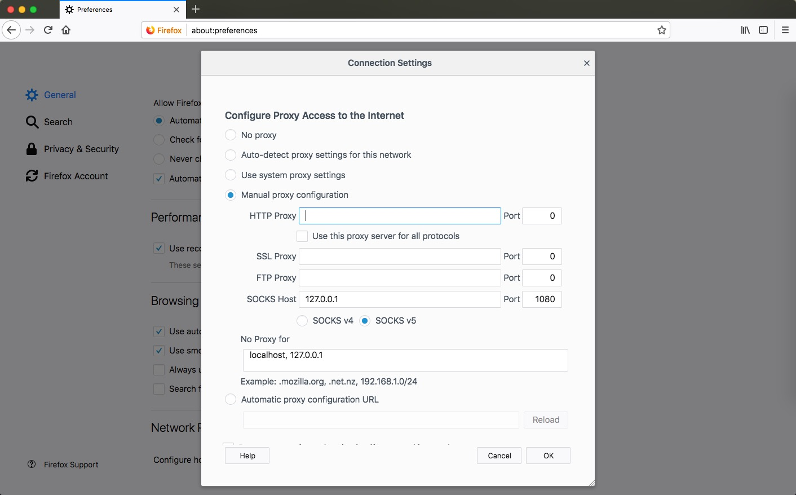

#  Connect AWS Shadowsocks on client.  

&nbsp;&nbsp;&nbsp;&nbsp; I'll write down the detail about connecting AWS Shadowsocks service on client. By the way, you can also follow the [Shadowsock WiKi](https://github.com/shadowsocks/shadowsocks/wiki) for the steps.  [Download Here](https://github.com/shadowsocks/shadowsocks/wiki/Ports-and-Clients)

+ Windows  
    - Shadowsocks GUI (Windows Platform .NET Framework required)

+ Mac OS X  
    - Shadowsocks  
    
  

+ iOS  
    - OpenWingy  
    
  

+ Web Browser
    - Google Chrome  
    
  

    
  

    - Firefox  
	
  
