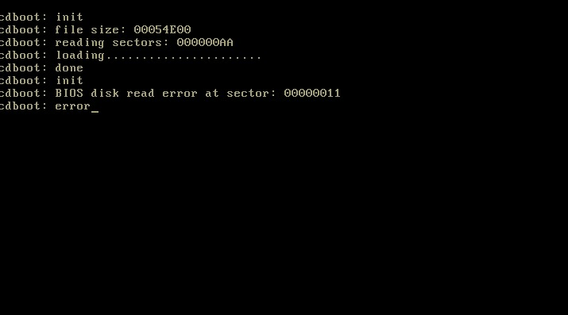
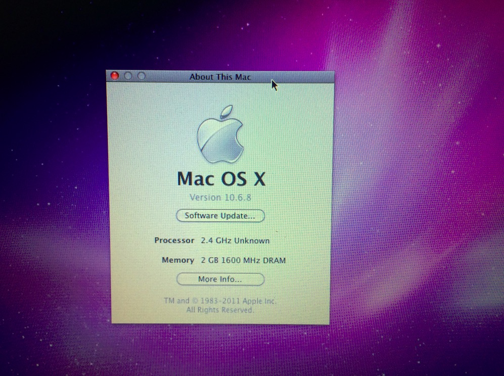

#  Create OS X(SnowLeopard) VM in VirtualBox

&nbsp;&nbsp;&nbsp;&nbsp; Yesterday I clean installed an Mac OS X SnowLeopard 10.6.8 VM-instance with VirtualBox on Fedora 26. In order to swtich platforms between OS X and Linux freely.  

## A: Reasons go for OS X SnowLeopard
&nbsp;&nbsp;&nbsp;&nbsp; <B>Basically, it natively runs perfectly on old machine like my ThinkPad T400</B>.  
&nbsp;&nbsp;&nbsp;&nbsp; Secondly, I remembered that I used to purchase an Mac OS X SnowLeopard 10.6 Retail DVD on [www.taobao.com](www.taobao.com) when I was in college a couple of years ago. I did my first time hackintosh on my Lenovo Ideapad G450 comes with Intel Pentium T4300, 2G RAM. It ran not as well as I had expected before because of the Graphic Drivers, Wi-Fi and the Ethernet problems. Wow, the OS X SnowLeopard on Macintosh can run smoothly with only 1 Gigibytes RAM. That was really awesome at that time and OS X left me a deep impression.
 <b>PS: </b> The SnowLeopard Retail DVD is still there under $30 on [ebay.com](www.ebay.com)

&nbsp;&nbsp;&nbsp;&nbsp; I've been trying the noraml method to create the macOS X 10.6 SnowLeopard, but the CPU of my laptop is Intel Core2 P8400, it always ends up with BIOS error on creating-failures like this:  
	```
		cdboot: BIOS disk read error at sector: 00000011
	```   
	<p align="center">  </p>

## B: Solution for VirtualBox. 
&nbsp;&nbsp;&nbsp;&nbsp; I worked it out by Google Search. [This post](https://www.leaseweb.com/labs/2015/08/run-osx-vm-virtualbox/) gives the main steps to make it almost all in Terminal.  
&nbsp;&nbsp;&nbsp;&nbsp; Open VirtualBox and follow the guides to create a virtual machine named "osx". <b>Then close the entire VirtualBox application and go to the command line (Bash, Zsh, etc)</b>. Run these 4 [VBoxManage commands](http://www.virtualbox.org/manual/ch08.html) in the terminal:  
	```  
		VBoxManage modifyvm osx --cpus 1  
	```  
	```  
		VBoxManage modifyvm osx --vram 2048  
	```  
	```    
		VBoxManage setextradata osx VBoxInternal2/EfiGopMode 5  
	```  
	```   
		VBoxManage setextradata osx "VBoxInternal2/SmcDeviceKey" "ourhardworkbythesewordsguardedpleasedontsteal(c)AppleComputerInc"  
	```  

&nbsp;&nbsp;&nbsp;&nbsp; Now back to VirtualBox over again. Start the instance with your retail Mac OS X SnowLeopard DVD image file. Follow the installer to install Operation System. You will get the SnowLeopard 10.6.0 version after the new OS installed. 


## C: Upgrade to the latest version 10.6.8 in SnowLeopard.
&nbsp;&nbsp;&nbsp;&nbsp; You can download the [Mac OS X 10.6.8 Update v.1.1](https://support.apple.com/kb/DL1400?locale=en_US) at Apple Official Support. Even you can click the AppleSoftwareUpdate for upgrading, but I do strongly recommend that you directly download from Apple Official Website and do the upgrading work. It will reboot after finished and then you will get the Mac OS X SnowLeopard 10.6.8 in the end. That's pretty simple.  
<p align="center">  </p>

