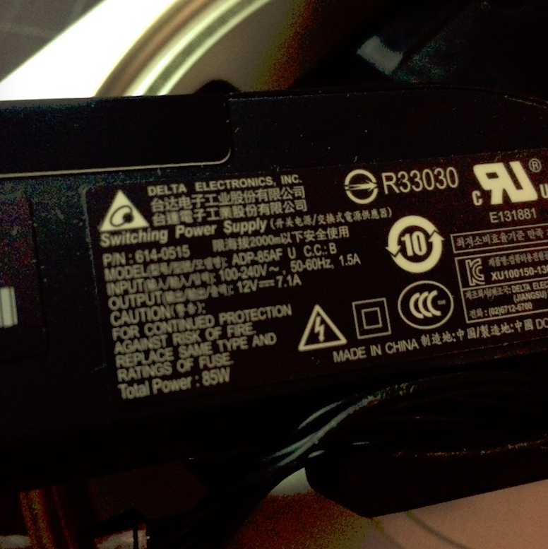
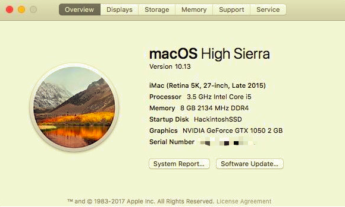
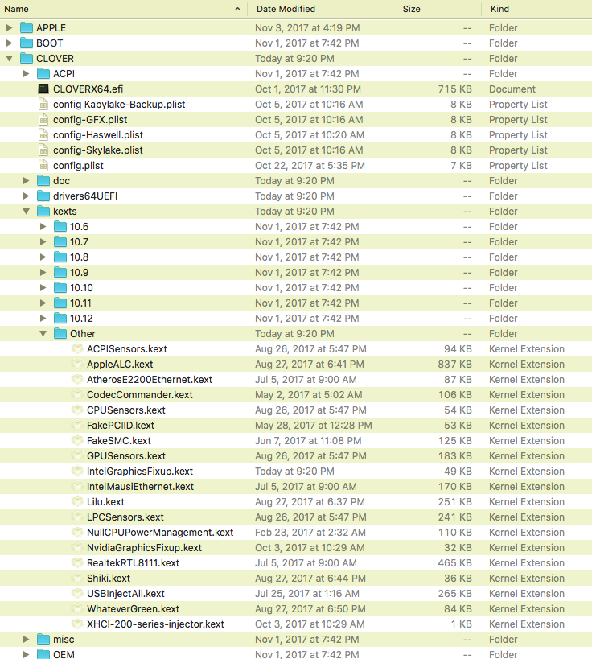
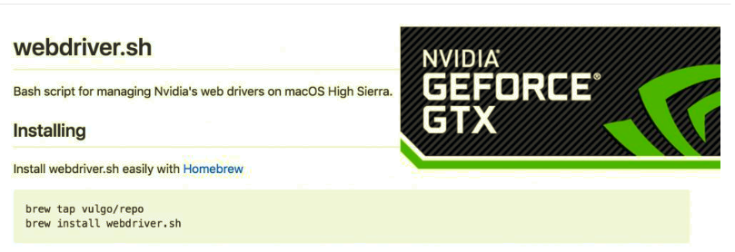
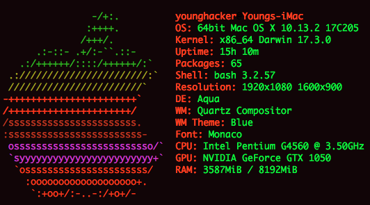

# Hackintosh on Intel Pentium G4560 (OS X 10.13.2)

&nbsp;&nbsp;&nbsp;&nbsp;By the end of Oct, 2017, nVidia had released the lastest WebDriver for GeForce GTX10 Graphic Card, here is the best solustion that DIYers can fix graphic-card supported on Macintosh. But I did build my first hackintosh only yesterday. It's pretty easy and it run more powerfully and smoothly than I think.

```javascript
	CPU: Intel Pentium G4560 2Core 4Thread 3.5GHz with Hyper Thread Tech
	Cooler: Intel Stock Cooler
	MOBO: Gigabyte B250m-D3H
	RAM: Crucial DDR4-2133 8G
	Graphic: Gigabyte GTX 1050 OC 2G
	Power: EVGA 450W (PS: I prefer Delta NX350 350W because Delta is one of Apple's Service/Order Provider)
```

&nbsp;&nbsp;&nbsp;&nbsp; This picture is taken when I open my Mac Mini 2014. The brand of Power is Delta.

<p align="center">  </p>

+ Step 1: Searching from Google for gathering basic information for hackintosh.  
	<p align="center">
	<b>Thanks and Thanks to these communities</b>.
	- [tonymacx86.com](http://www.tonymacx86.com)
	- [<b>hackintosher.com</b>](http://hackintosher.com) &nbsp;&nbsp;&nbsp;&nbsp;&nbsp;<b>Strongly Recommend</b>
	- [amd-osx.com](http://amd-osx.com). &nbsp;&nbsp;&nbsp;&nbsp;&nbsp;&nbsp;&nbsp;&nbsp;&nbsp;&nbsp;&nbsp;&nbsp;Supporting AMD Ryzen CPU
	</p>  
+ Step 2: Just hack it.  

	&nbsp;&nbsp;&nbsp;&nbsp; I followed with [<B>this post</B>](http://hackintosher.com/guides/high-sierra-install-full-guide/) to start my own hackintosh and hacked successfully only once. But there is a big problem with nVidia WebDriver on macOS 10.13. The screen is somehow laggy and frozen sometimes.  

	<p align="center">  </p> 

	<B>The most important thing in hackintosh is to Backup your EFI partition folder!</B>  
	<B>The most important thing in hackintosh is to Backup your EFI partition folder!</B>  
	<B>The most important thing in hackintosh is to Backup your EFI partition folder!</B>

	<B>PS: There's a better way to Hackintosh your PC. Just restore your TimeMachine to your Hackintosh. That's the easiest way.</B>

+ Step 3: Install Utils and Apps.  
	
	- [HWMonitor](https://github.com/kozlek/HWSensors): Don't forget to add the kext files to EFI parition from the DMG-Package.  
	<p align="center">   </p>

	- <b>Xcode.  
	&nbsp;&nbsp;&nbsp;&nbsp; I rebooted the hackintosh after I installed the Xcode from Mac App Store, it couldn't login system while with the infinity booting loop.  
	&nbsp;&nbsp;&nbsp;&nbsp; Don't worry! Using your Backup-EFI folder to restore current EFI folder again. Then, Reboot.  
	&nbsp;&nbsp;&nbsp;&nbsp; Everything will go back.  Here is my [EFI](https://github.com/toureek/hackintosh).</B>

+ Step 4: Upgrade to the latest macOS High Sierra(17C205) from Mac App Store.  

	<p align="center">  </p> 

+ Step 5: Upgrade to the latest [nVidia WebDriver](https://images.nvidia.com/mac/pkg/378/WebDriver-378.10.10.10.20.107.pkg).

	&nbsp;&nbsp;&nbsp;&nbsp; This new released WebDriver fixes the primary bugs in previous version that makes my graphic card run smoothly with macOS native animations on macOS High Sierra.  

	<B>PS: The easiest way to install WebDriver is using Homebrew</B>
	<p align="center">  </p>
	<p align="center">  </p>

+ Summery: <b>I do really strongly recommend that anyone should start building hackintosh from an Intel Core-i5 </b> (Core-i5 is much better than Pentium. By the way, maybe AMD Ryzen CPU is another better choice), because the performance of Pentium G4560 is not as good as I had expected before especially when editing videos in iMovie (spliting videos, cutting pictures, adding transitions etc). My hackintosh(G4560 + 8G RAM + GTX1050) does exporting the final video even slower than my Mac Mini 2014 (Core i5-4260U + 8G RAM) because of the G4560 CPU is lack of <b>AVX2.0 instruction set which particularly does the MultiMedia part</b>. However, G4560 + GTX1050 is still a pretty good gaming-console on Windows platform as long as you play games.  

++++++++++++++++++++++++++++++++++++++++++++++++++++++++++++++++++++++++++++++++++++	

+ <b>First Review:</b> I've been using this hackintosh for 2Days for programming iOS codes and I've tried many softwares to adjust the performance of this hackintosh. So I need to append something more.  
	- <b>Power Consumption</b>: It runs perfectly more than I think except power consumption.  
		&nbsp;&nbsp;&nbsp;&nbsp; I used to use my laptop/Macbook pro/Mac Mini at the same time almost 24hours/day, and the total power consumption is nearly 1kWh/day more or less. But when I only use my hackintosh there all day, the total power consumption is up to 2kWh/day more or less. The G4560 TDP is 54W, GTX1050 OC TDP is 75W, Motherboard TDP 30W, etc, In Total TDP: 182±5 W. 

	- <b>Graphic Card</b>:  It doesn't make fully use of. I don't know if the reason is the performance of CPU.  
	&nbsp;&nbsp;&nbsp;&nbsp; Most of the time it doesn't work along with other daily programs such as <b>iMovie which rely on more CPU than GPU</b>. And I download [Adobe Premiere Pro](http://www.adobe.com/products/premiere.html) for a free trial. Then I make a test for the graphic hardware acceleration in PR for editing and exporting video in 1080p 25frame FHD. I'm puzzled by the usage of GPU on my hackintosh is always in 10%-25%, but it does work really faster than iMovie in the fact. The TDP of GTX1050 is 75W.  

	- <b>The Next Time Hackintosh</b>:  A better Mac Mini Style in the next time hackintosh.  
	&nbsp;&nbsp;&nbsp;&nbsp; I'm not into a performance beast so I'll pick up a Mac Mini Style Hackintosh according to the CPU performance on [Geekbench List](https://browser.geekbench.com/processor-benchmarks) in the future. And I'm always looking forward to AMD Ryzen CPUs and Zen APU CPUs if the TDP is not too high.  

		- MOBO: Still Gigabyte, Keep No Change.
		- CPU:  Still Intel(Keep pace with Apple Product-Line), but the TDP of the CPU named after 7xxxT is only 35W.
			* A: Core i3-7100T (<b>$$</b>. If you have a G4560(<b>$</b>), I do not recommend you to buy this one any longer, it almost makes no difference in performance except Multi-Media Editing. Actually, you can never ever think about it. <b>Low TDP with Low performance</b>.)  
			* B: Core i5-7400T (<b>$$$</b>. Middle Budget with normal performance)
			* C: <B>Core i5-7600T</B> (<b>$$$$</b>. Middle Higher Budget with higher performance)
			* D: Core i7-7700T (<b>$$$$$</b>. High Budget with US Dollars.)  
			* E: <B>Core i7-6700, i7-6700K, i7-7700, i7-7700K (<b>$$$$$$</b>. High Budget with US Dollars and performance.)</B> 
			* F: AMD Ryzen 1700. (It's a pretty good CPU with 65W TDP) 
		- Graphic: GTX1030 (TDP is only 30W with its performance is much more than any Mac Mini. That's it.)
		- RAM: The More, The Better.
		- POWER: Delta.

	- <b>Compares In The End</b>: Comparing the real Macintosh to Hackintosh on <B>Performance</B> especially in Multi-Core Performance on [Benchmarks](https://browser.geekbench.com/mac-benchmarks).

