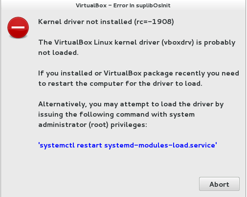

#  Install VirtualBox in the right way. (Kernel driver not installed rc=-1908)

&nbsp;&nbsp;&nbsp;&nbsp; I did upgrade to the latest linux kernel on Fedora 27 tonight, but I cannot start any virtual machine instance after the reboot. So I google for the error message like this  

<p align="center">  </p> 


&nbsp;&nbsp;&nbsp;&nbsp; I used to fix this issue before, but this time I'll write down the solutions for the people who need help.  
&nbsp;&nbsp;&nbsp;&nbsp; Here is the solution: <B>Install development kernel and dkms</B>. 

-

* Condition A: You have installed VirtualBox on your Linux.

	```  
		su   // Input your super-admin password to get the permission
	
		dnf update
		
		dnf install -y kernel-devel-$(uname -r)
		
		dnf install -y kernel-headers-$(uname -r)

		dnf install -y dkms

		// Apply for the configuration
		sudo /sbin/vboxconfig  

		sudo reboot
	```  

&nbsp;&nbsp;&nbsp;&nbsp; You can start any virtual instance over again after the next time you enter to desktop.  

-

* Condition B: You have not installed VirtualBox on your Linux.  

&nbsp;&nbsp;&nbsp;&nbsp; Download the [VirtualBox](https://www.virtualbox.org/) for your target Linux platform. As for me, I go for *.rpm for Fedora.

	  
		rpm -qa | grep -i virtualbox   // Check if exist virtualbox on your linux
		
			// if exist, remove it all.
			yum remove -y virtualbox
			
		   // if there is no software package named 'virtualbox', keep going on
		   
		   
		dnf install -y kernel-devel-$(uname -r)
		
		dnf install -y kernel-headers-$(uname -r)

		dnf install -y dkms
		
		rpm -ivh virtualbox.rpm   // Install virtualbox in terminal way

	  
	

&nbsp;&nbsp;&nbsp;&nbsp; You can create a new virtual instance now.  