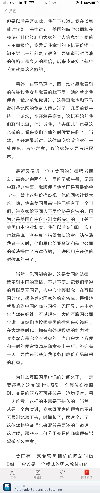

 

经济学- 需要系统地学习一下： 

+ 战俘营里的经济组织： 只要有市场交易 人们就能够产生幸福。
+ 有人在的地方就有需求，有两个人或两个人以上就会有不同的需求，有需求就有交易，有交易就有价格，有价格就会有货币需求，有货币需求就可能出现劣币驱逐良币的现象，有交易就会有信息不对称，有信息不对称就会有中间商，有货币就会有波动，有波动就会有通货膨胀和通货紧缩。 市场周边，有人在，就会有情绪，就会有舆论等等等等。
+ 公平和效率的问题：
美国的马粪案例： 社会整体的公平效率的考量就是法律长期维护的基准，社会的公正的背后也是整体效率的考量。
+ 经济学家看得见和看不见的东西【需要推测 才能看得见的东西】。（巴斯夏） 好的经济学家和坏的经济学家。
+ 经济学在现代更多的研究的是【事与愿违的规律】，在资源稀缺的前提下，通过经济手段获取最大化有利结果
+ 《不确定性，进化与经济理论》: 因为世界是不确定性的，所有不一定能计算出经济问题的最优解，最多能算出最优解的概率区间【在边界内做事情，才更可能成功】

   

+ 经济学的基本假设：人不一定是理性的，人也不一定是自私的，有个大的前提是，市场是具有不确定性，经济学建立在稀缺上(客观事实)，稀缺导致选择不同，也就差异对待，就是歧视的逻辑。
+ 经济学并不关心人是不是理性的这样的问题，经济学关心的是存活的问题。
+ 市场是陌生人与陌生人之间打交道的地方，商业是最大的慈善。
+ 二分法看待人性、市场。
+ 社会总体长期效率有效的规则(长期指导人们行为的参考)，才能决定公正，这是个效率考量。
+ 经济学其实更多研究的是【事与愿违】的事实(好心办坏事的情况)。(芒格的逆向思考，巴菲特午餐的逆向回答)
+ 不确定性，进化与经济理论 (引用最多的两三篇文章)
+ 商业行为(有规则，且市场有具体的反馈机制)与慈善行为(有依赖，但从来没有反馈)的对比.
+ 稀缺导致人的选择发生有趣的选择，你喜欢的别人也喜欢，人的欲望是无底洞。
+ 只要出现了歧视现象，那么主动歧视的人，也会负有代价。
+ 合理的歧视是正常的(Amazon给我的价格并不一致，而且美国法律已经生效，保护企业可以这么做)

  

 

+ 当一个非常小的零件、设备被生产出来的时候，每一个参与生产的人，他们所做出努力时，不知道会产生什么，我们每个人到现在只需要付出很小的代价就可以得到它，这是分工合作的结果，是市场的作用。
