#  New Budget Promising PC in Early 2018 
&nbsp;&nbsp;&nbsp;&nbsp; I took my first Mac Mini 2014 (Core-i5 1.4GHz(2C4T), 8G RAM CTO) within one 128G SSD which replaced the orginal one 500Gb HDD hometown for my parents on the Spring Festival 2018.  And that was the second reason I built my first hackintosh last week.  

<p align="center"> 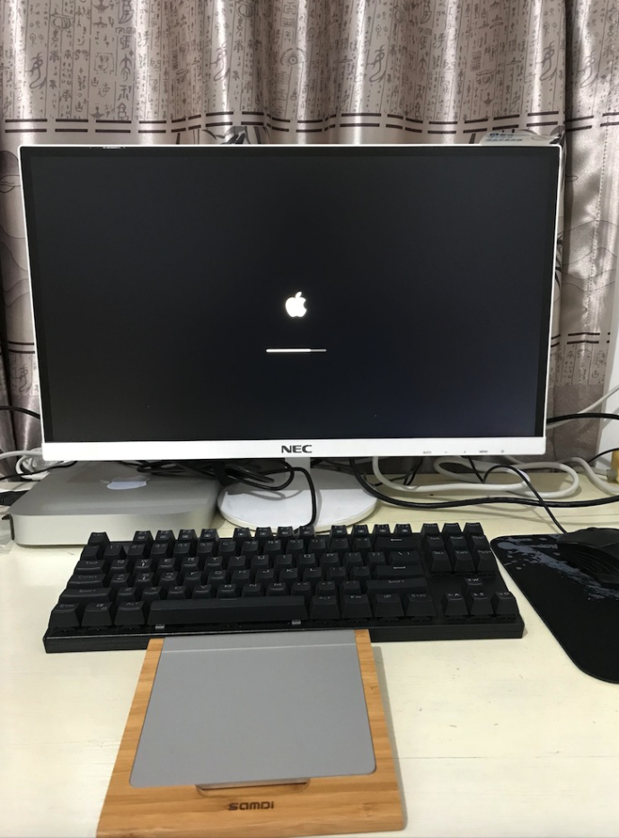 </p> 


&nbsp;&nbsp;&nbsp;&nbsp; After I built the Intel-Based hackintosh sucessfully, my girlfriend told me that she wanted one even though she had a Macbook Pro 2015, too.  So I did the math for searching the lowest cost parts in DIYs. Bingbo, I finally founded it that the 8th Generation of Intel CPU (Core-i3 8100, 3.6GHz, 4C4T) would stand a very budget chance if working with ASRock H110m MotherBoard which almostly target for the 6th/7th Generation Intel CPUs. Becuase the non-stock Intel Core-i3 8100 cost less than ￥600($95) on [www.taobao.com](http://www.taobao.com) and the most important info is that ASRock H110m MotherBoard costs less than ￥210($34) on [www.jd.com](http://www.jd.com) and it could be upgraded BIOS for supporting the 8th Gen Intel CPUs which means I could upgrade cpu from 6thGen to 8thGen on Intel platform. By the way, AMD Ryzen CPU is really great, but the motherboard is too expensive so far. Oh Boy! That's it.  

&nbsp;&nbsp;&nbsp;&nbsp; In consideration of the fact that my girlfriend used to work on office-working and suffering Internet for the most general daily scense.  I changed my mind for the target CPU as the 6th Gen Intel Celleron G3900(2.8GHz, 2C2T). Thus I could teach her programming on Linux platform if she would like. Thanks to the SSD for the performance, I thought it was not a big problem.  

&nbsp;&nbsp;&nbsp;&nbsp; I bought the most parts on JD.com and Taobao.com last Thusrday and I did received all goods which bought on JD.com the current day and I received CPU last night. China has already become the global leader in express delivery fields. 

```   
CPU:             InStock Intel G3900                200
MotherBoard:     InStock ASRock H11Om DVS           209
Power:           InStock Delta-NX350                179
Storage:         InStock Kingston 120G SSD          275
Console Case:    InStock PuEstar                     30
Console Fan:     NonStock Fan                        12.9
Bluetooth:       InStock U-CSR Bluetooth 4.0         24
Input:           InStock Keyboard+Mouse              18.9
USB Case:        InStock UNITEK USB*4                 9.9
Wi-Fi:           InStock Tenda Wi-Fi                 25
Auido:           InStock LOYFUN LF-501               12.9
Memory:          I have an old Curcial 8G DDR4-2133   0
Monitor:         I have an old Dell 1600*900          0
Total:                                             ￥996.6（$157.42 within Fee&Tax）
```  

<p align="center"> 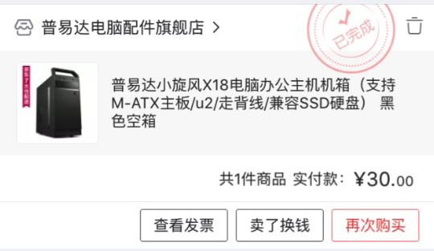 </p> 
<p align="center"> 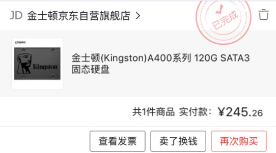 </p> 
<p align="center"> 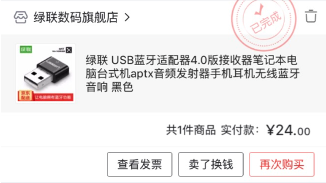 </p> 
<p align="center"> 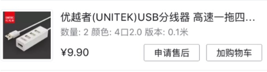 </p> 
<p align="center"> 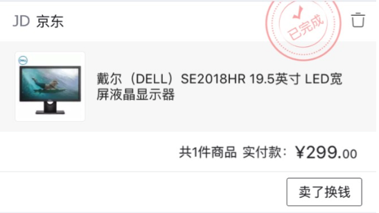 </p> 
<p align="center"> 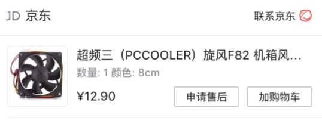 </p> 
<p align="center"> 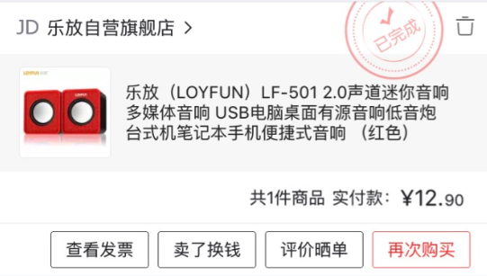 </p> 
<p align="center"> 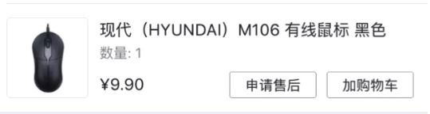 </p> 
<p align="center"> 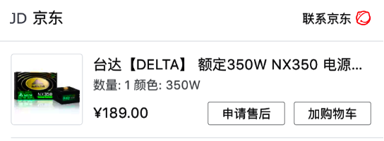 </p> 
<p align="center"> 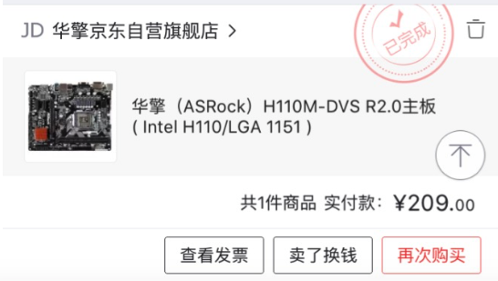 </p> 
<p align="center">  </p> 
<p align="center"> 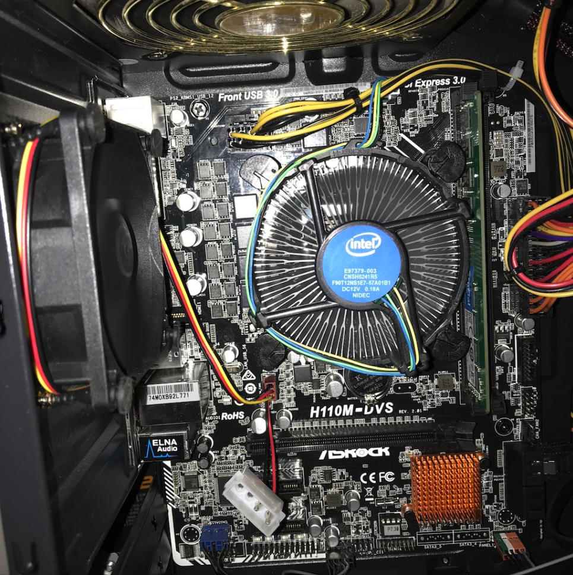 </p> 

&nbsp;&nbsp;&nbsp;&nbsp; That's where I spend the entire morning. I hope it can help you to decide which to buy for your own purpose. I will update this post if I hackintosh in the future. Just take a break and enjoy my first foreign beverage.
<p align="center"> 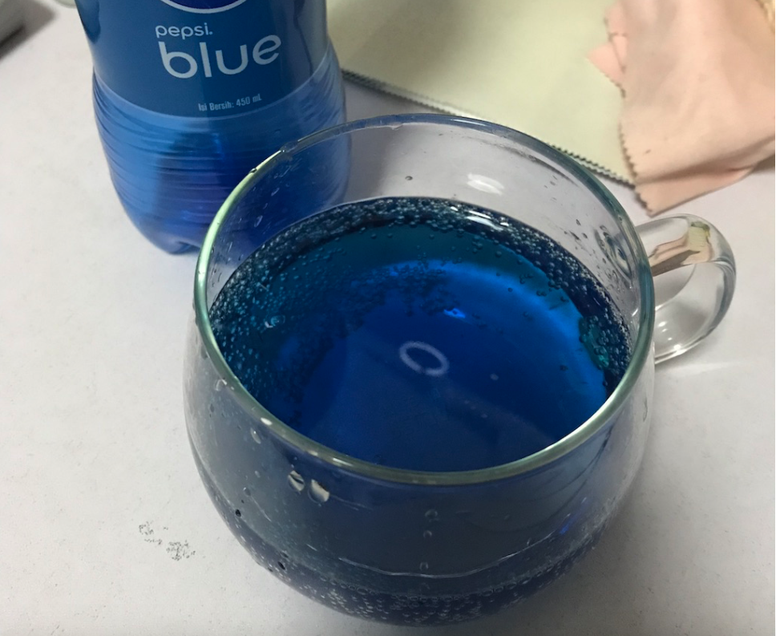 </p> 
