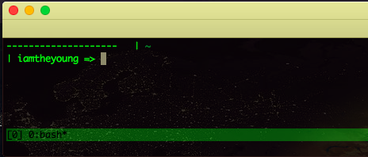
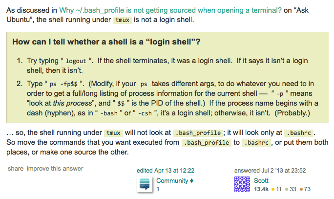

# Replace zsh with bash in tmux in macOS Terminal

&nbsp;&nbsp;&nbsp;&nbsp; I've been using [iTerm2](http://www.iterm2.com) and Zsh on macOS for long, but I find it the iTerm2 on macOS is running obviously slower than native bash even loading the same configuration file(.zshrc). And the most important fact is that the [tmux](https://github.com/tmux/tmux) in zsh is often stucked with no respondings and it shows the beachball all the time on macOS. So I decide to change my default tmux-shell from zsh to native bash on macOS. By the way, it doesn't happen to be stucked on fedora linux so far.   

+ A: Create tmux config file <B>.tmux.conf</B>.  

&nbsp;&nbsp;&nbsp;&nbsp; Open the Terminal, create the tmux config file

```javascript  
	touch .tmux.conf
```  

+ B: Add config params into the config file.  

&nbsp;&nbsp;&nbsp;&nbsp; Open file in VI and edit the config.	
```javascript  
	vi ~/.tmux.conf
```  

&nbsp;&nbsp;&nbsp;&nbsp; Change the default Tmux-Shell from zsh to bash.  

```javascript  
	set -g default-shell /bin/bash
	set -g default-command /bin/bash
```  

+ C: Quit from Terminal. Then reopen the terminal, go to tmux and locate to the config file.  
&nbsp;&nbsp;&nbsp;&nbsp; Open tmux, Go to command-mode with Ctrl+B (Your Command Prefix), 'source-file ~/.tmux.conf' make the change.

```javascript  
	tmux  

	source-file ~/.tmux.conf
```  


+ D: The next time when you open tmux, the default-shell becomes native bash. Enjoy it.  
<p align="center">  </p>   

+ <B>E: Addtional Tips: <font color="red">The bash-shell in tmux doesn't load .bash_profile as native bash in macOS Terminal</font></B>.  
&nbsp;&nbsp;&nbsp;&nbsp; <B>Because this shell running under tmux <font color="red">[is not a login shell](https://askubuntu.com/questions/121073/why-bash-profile-is-not-getting-sourced-when-opening-a-terminal)</font></B>.  
<p align="center">  </p>  
&nbsp;&nbsp;&nbsp;&nbsp; So we need to focus on the <b><font color="red">.bashrc</font></b> the same with .bash_profile as well. You can paste the config in .bashrc the same with .bash_profile. Everything will go well again.  


```javascript  
	cat ~/.bash_profile >> ~/.bashrc
```   
