#  Setting up Shadowsocks on Amazon Web Service

&nbsp;&nbsp;&nbsp;&nbsp; I did receive the email from [Amazon Web Service](http://aws.amazon.com) at midnight. It tells me that my free trial of AWS-EC2 instance which is running for almost 12 months, will be charged in Amazon Basic Plan (On-Demand) after one week. So I terminated the EC2-host this morning and I closed my AWS-Account at the same time. I used to be charged in 21 US.Dollars last year since I forgot to close my last AWS-Account and I'll never make mistakes at this time.  

&nbsp;&nbsp;&nbsp;&nbsp; I'll create a new AWS-Account for setting up a new Shadowsocks Service on EC2 which supporting me for proxying my networking. Because I'm enjoying <b>connecting with the free World-WAN</b> more than limited LAN in China Mainland.

+ <b>Basic Requirments</b>: 
    - A Debit/Credit Card which can be settled in US.Dollar($)
    - A Legal Email
    - Access Networking on Computers / Laptops

+ <b>Create An AWS Account</b>  
	- [SignUp An Amazon-Web-Service Account](https://portal.aws.amazon.com/billing/signup?nc2=h_ct&redirect_url=https%3A%2F%2Faws.amazon.com%2Fregistration-confirmation#/start)

+ <b>Setup an EC2-Host (Server)</b>  

&nbsp;&nbsp;&nbsp;&nbsp; After you created an AWS-Account, you will enter the AWS console page. Just like the picture below. Follow the steps to create your own EC2 instance for free.

 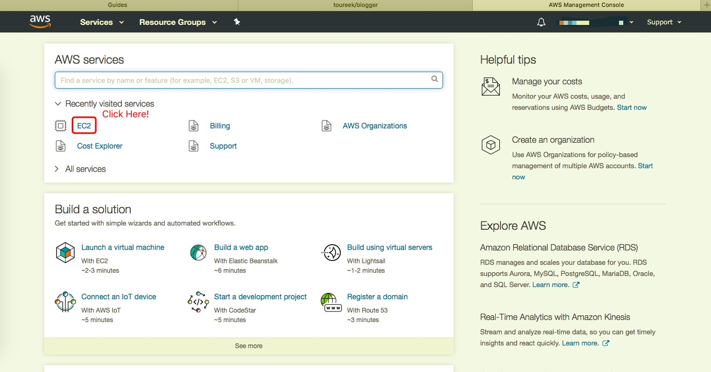 

&nbsp;&nbsp;&nbsp;&nbsp; Start an instance    

 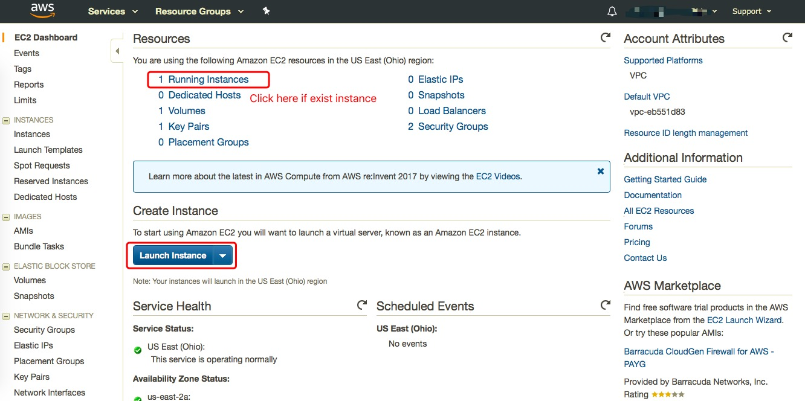 

 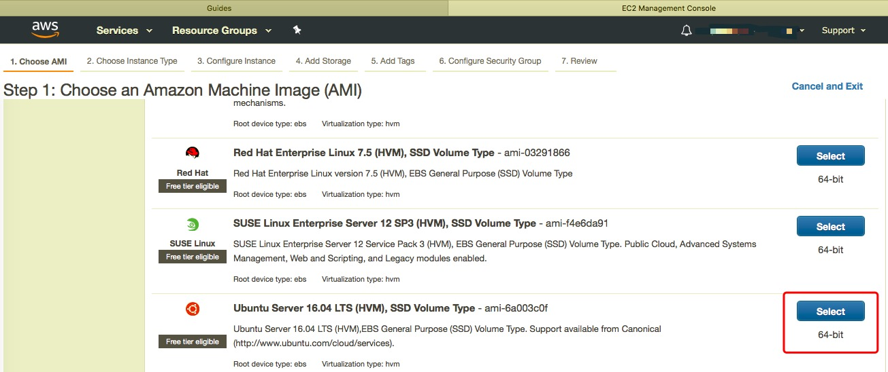 

 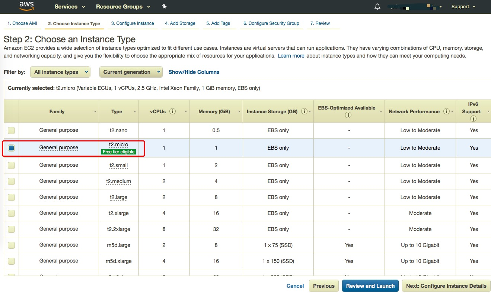 

 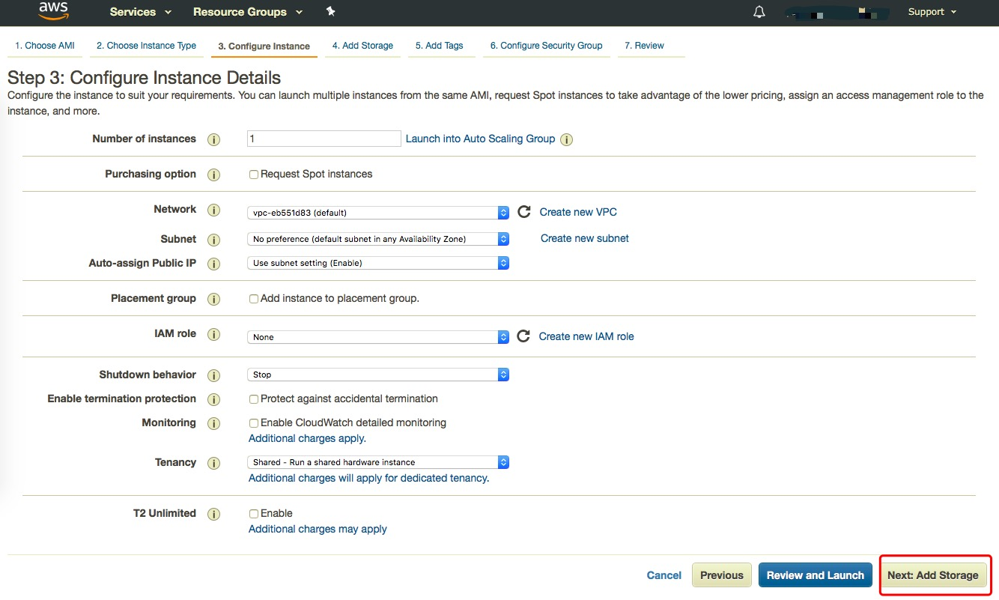 

 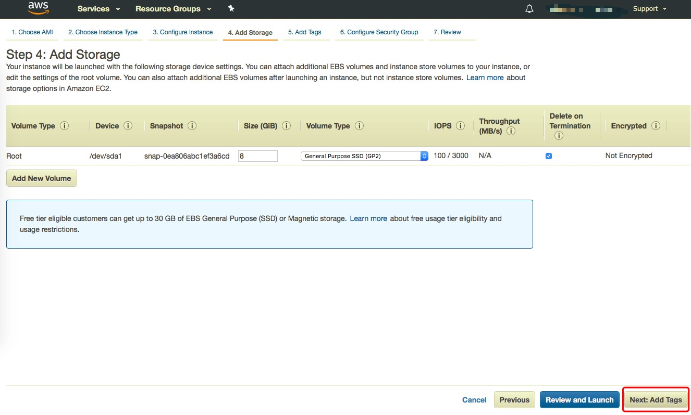 

 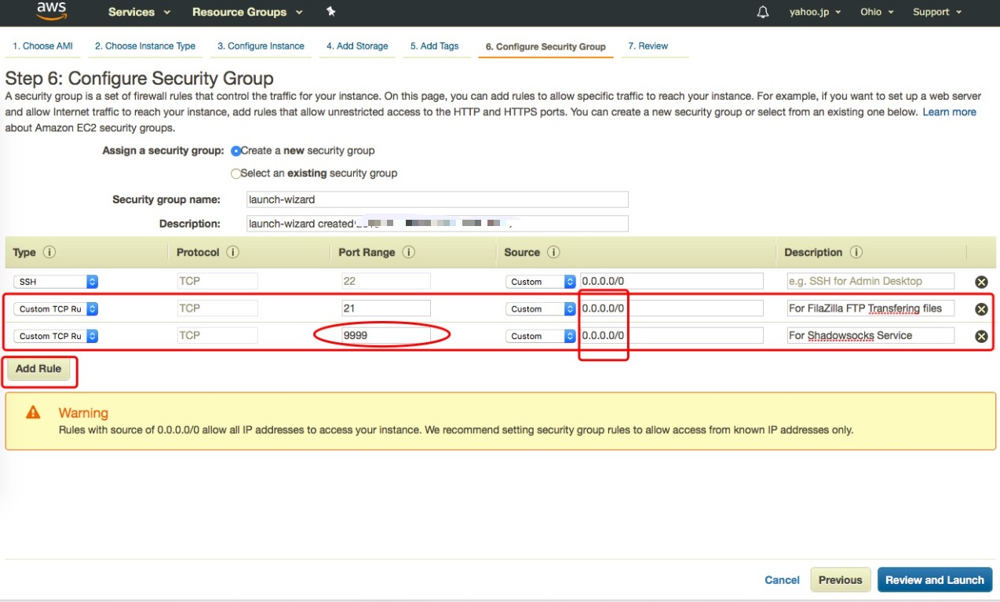 

 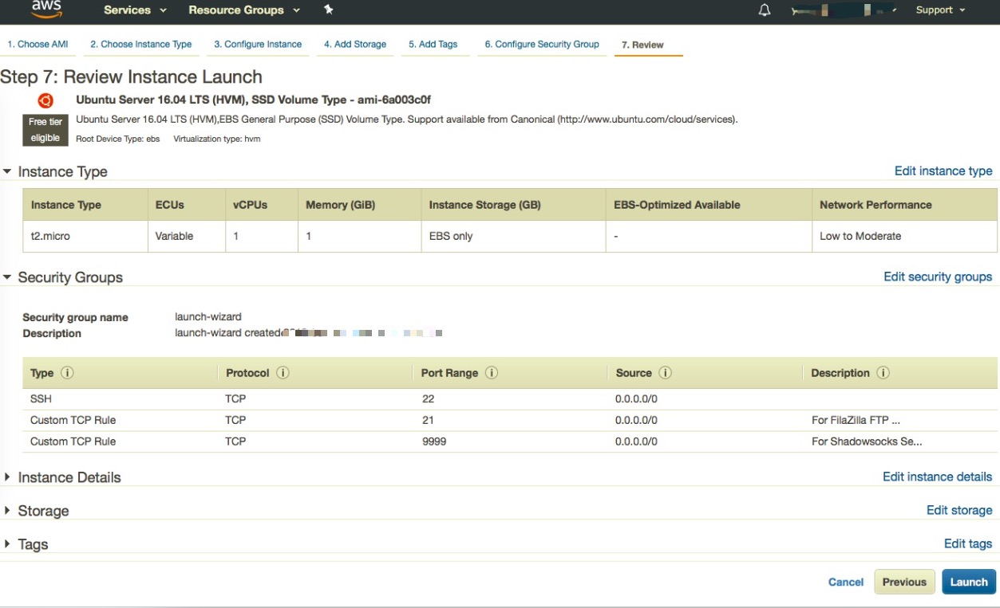 

 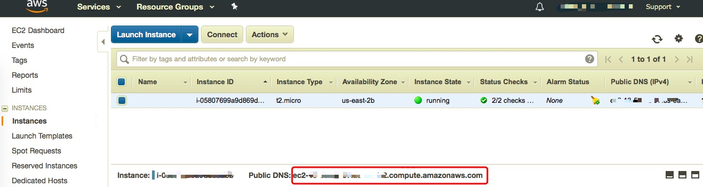 

 
&nbsp;&nbsp;&nbsp;&nbsp; There you go, you have a brand new EC2-Instance now.    

 

+ <b>Connect to AWS EC2-Host in SSH</b>  

&nbsp;&nbsp;&nbsp;&nbsp; First of all, we need to get the private pem file for security. When you click Connect-Button and then download your own pem file.   

 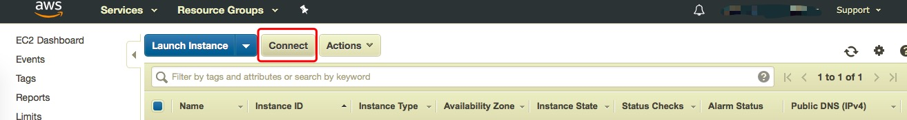 
  

&nbsp;&nbsp;&nbsp;&nbsp; We can connect to the AWS-EC2 instance in SSH which is the most popular way among developers. I configurate the shell-command in <b>.bash_profile</b> and <b>.zshrc</b> like this.
    

  

  

+ <b>Setting up Shadowsocks-Server on EC2-Host</b>
	- <b>Install Shadowsocks on Ubuntu-Server.</b>
		
 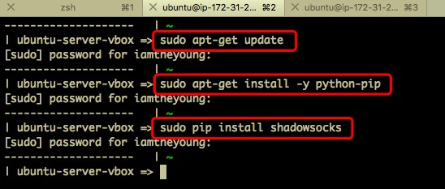 
	
	- <b>Create Shadowsocks Config File, especially in server_port be same with the port config on AWS</b>
		
 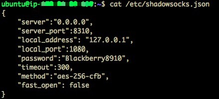 
	
	- <b>Disable FireWall and Start Shadowsocks Service	</b>
		
 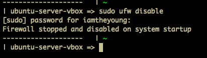 
	
		
 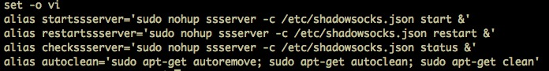 
	

+ <b>Check the AWS-EC2</b>
	
 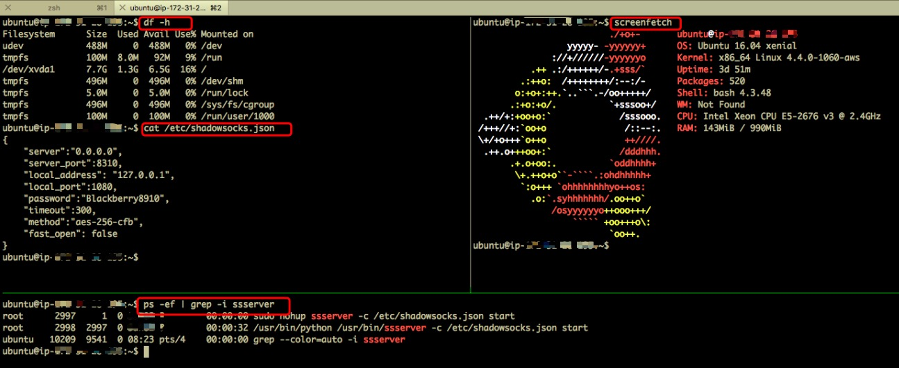 
	
	

