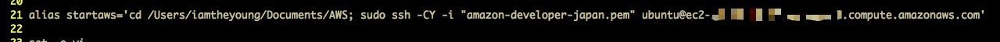
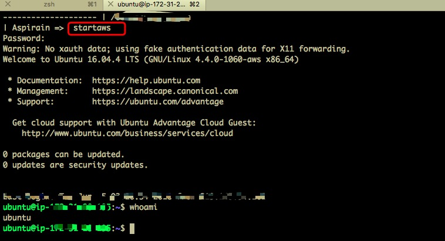
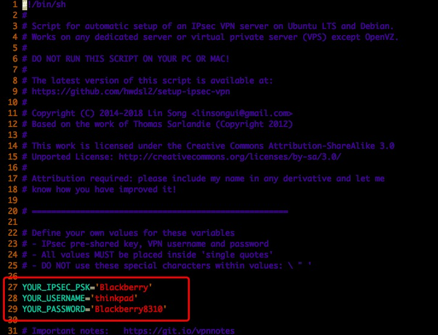
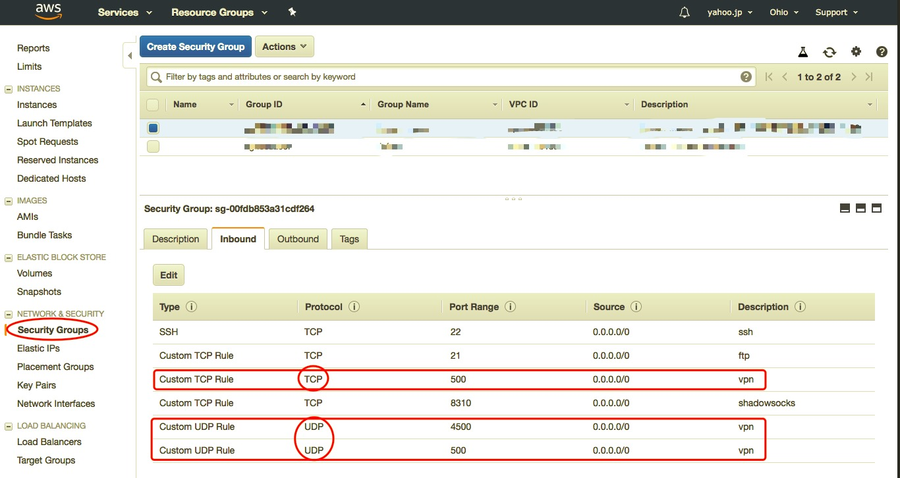
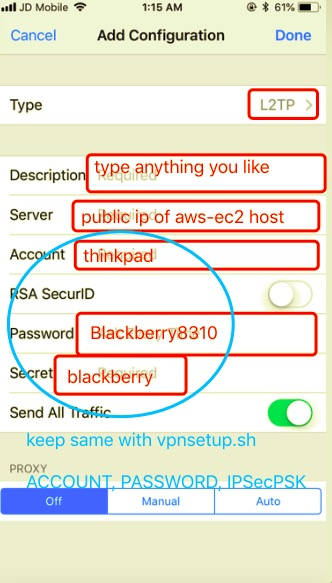
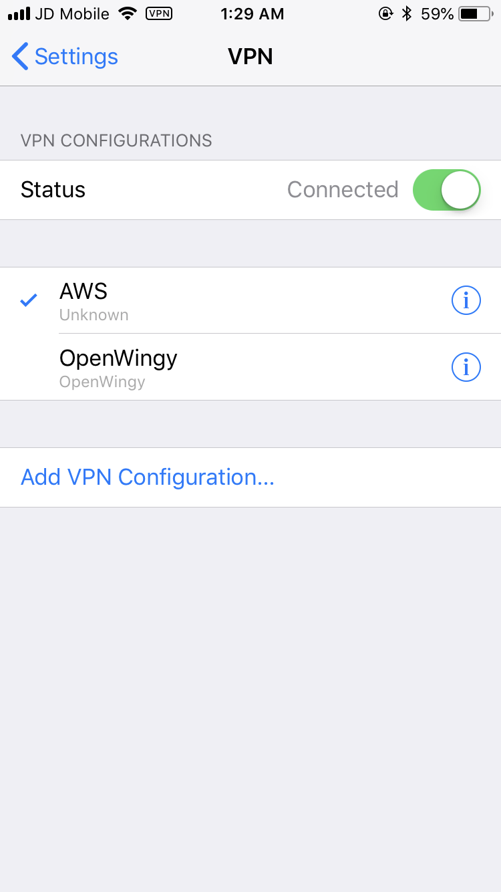
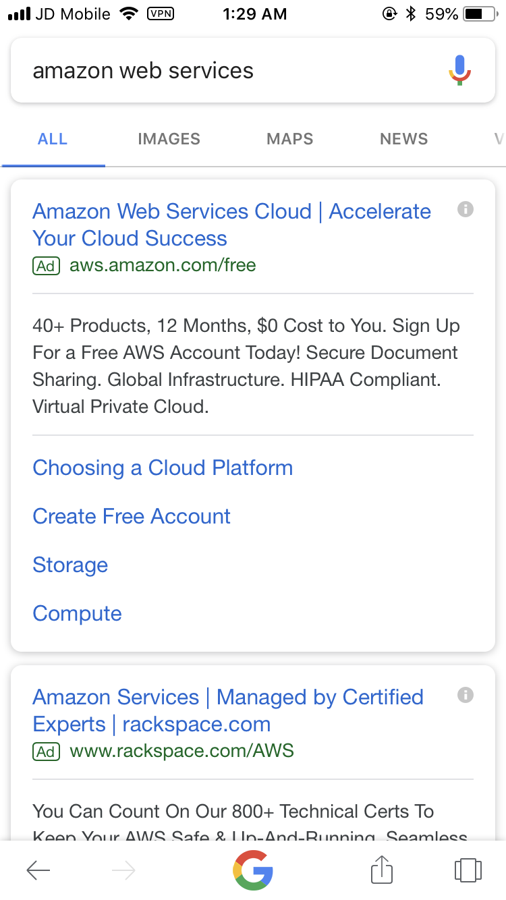

# Setup VPN service on AWS  

&nbsp;&nbsp;&nbsp;&nbsp; Some friends told me that the Wingy App had already been disappeared in Apple AppStore, however, they still want to connect Internet through out the Great-FireWall. So I have to come up with my final solution: Setup an brand new VPN (Virtual Private Networking) on AWS. Becuase vpn can work on any platform (Mac / Linux / Windows / Android / iOS).


+ Step 1: You need to setup an AWS EC2 host.  
&nbsp;&nbsp;&nbsp;&nbsp; The previous post of [< Setup the Shadowsocks on Amazon Web Service >](./Readings/Setup-Shadowsocks-On-Amazon-Web-Service.md) can help you get there.

+ Step 2: Connect to AWS EC2 host.
<p align="center">  </p>
<p align="center">  </p>

+ Step 3: Fetch an opensource VPN Shell-Script named vpn

```javascript
   wget https://git.io/vpnsetup -O vpnsetup.sh     // Fetch an vpnsetup.sh file by wget command
```

+ Step 4: Config VPN Params and Ports in vpnsetup.sh
```javascript
   vi ~/vpnsetup.sh      //  Edit vpnsetup.sh in vi editor
```
&nbsp;&nbsp;&nbsp;&nbsp;&nbsp;&nbsp;&nbsp;&nbsp; Config <B>Account, Password, IPSecPSK</B>

<p align="center">  </p>

+ Step 5: Config AWS on Web Console.
&nbsp;&nbsp;&nbsp;&nbsp;&nbsp;&nbsp;&nbsp;&nbsp; Pay attention for TCP/UDP port. 500 & 4500.
<p align="center">  </p>

+ Step 6: Start VPN service on EC2 host.

```javascript
   sudo nohup sh vpnsetup.sh &
```

+ Step 7: Connect VPN on client.

<p align="center">  </p>


+ Step 8: Just Do it.
<p align="center">  </p>
<p align="center">  </p>

