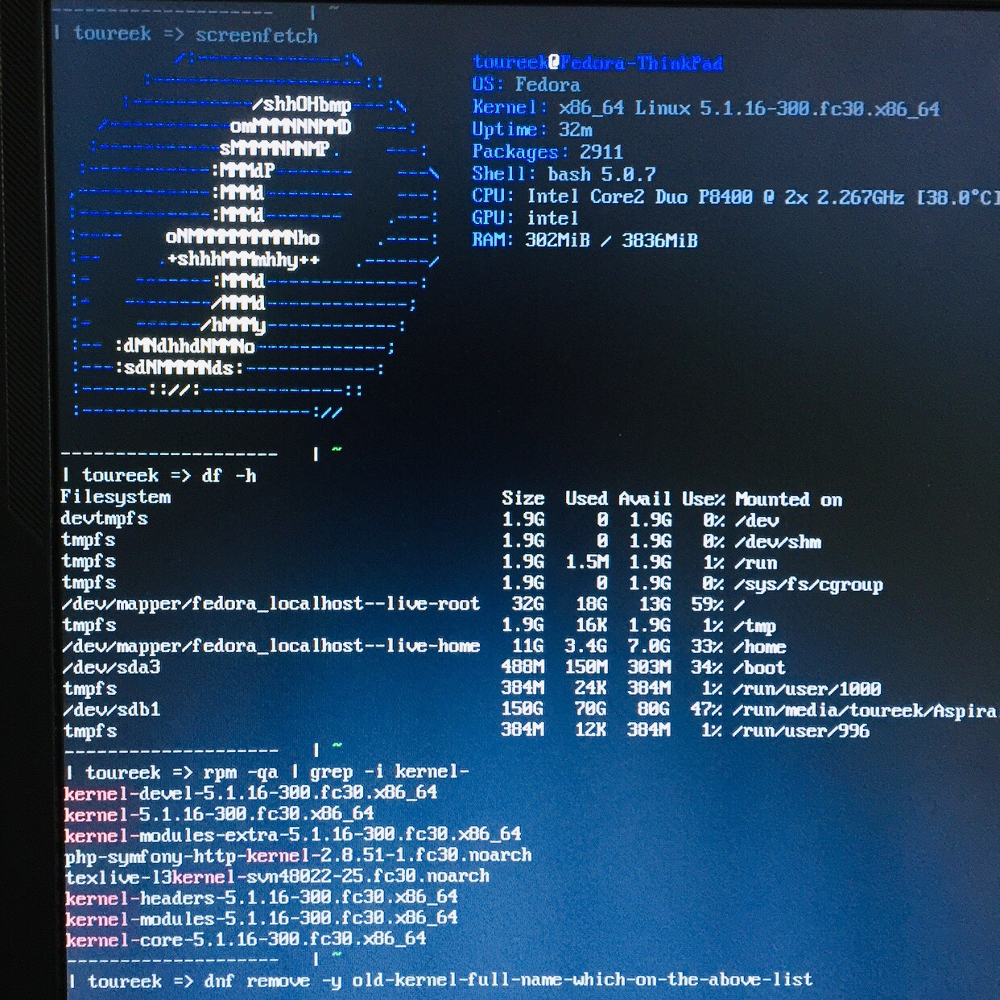

# Upgrade Fedora 29 to Fedora 30

&nbsp;&nbsp;&nbsp;&nbsp; I prefer Fedora more than Ubuntu just because fedora always can finish the work out without any configuration after the Operating System installed or upgraded especially on my very very old laptop (ThinkPad T400). IBM had finished buy the entire Red-Hat for its open-source projects this week, Why not try [Fedora](https://get.fedoraproject.org)? There we go!

### Upgrade OS using the command line  
- Login to the shell as root.  

### Update softwares and back up your current system
- dnf upgrade --refresh

### Install the DNF plugin  
- dnf install -y dnf-plugin-system-upgrade

### Start the update with DNF  
- dnf system-upgrade download --releasever=30

### Reboot and wait for the upgrading operation finished
- dnf system-upgrade reboot

### Clean old linux-kernels and packages after the upgrading
- dnf clean all 
- uname sr       // check the linux-kernel-name which current using
- dnf remove -y old-linux-kernel-full-name

&nbsp;&nbsp;&nbsp;&nbsp; PS: I'm fond of using my first ThinkPad T400 laptop for 9 years since 2010, it's pretty cool with the best keyboard, however, the performance is far behind the ones nowadays. I choose [XFCE4](https://spins.fedoraproject.org/) instead of GNOME on fedora as my desktop-environment because it's quite light and super easy to get started. I hope you will like XFCE4, too.

  
  

 

