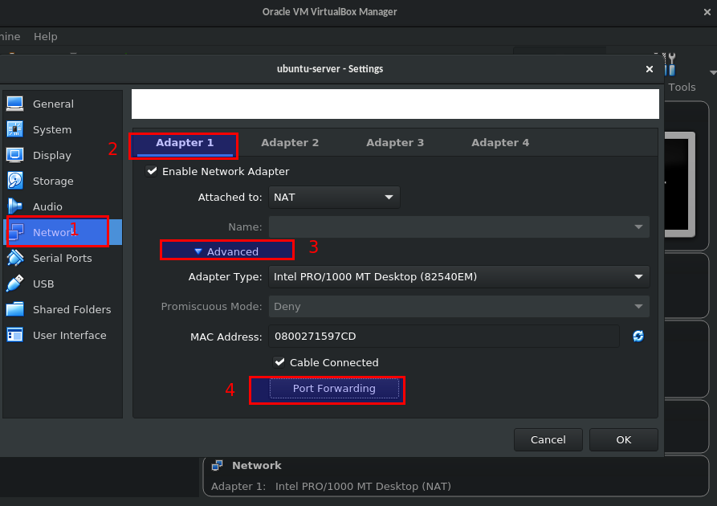
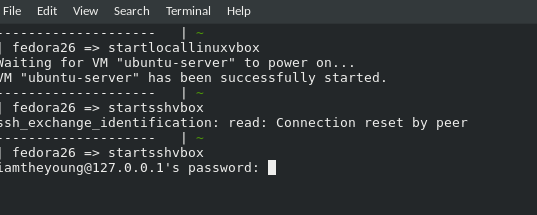
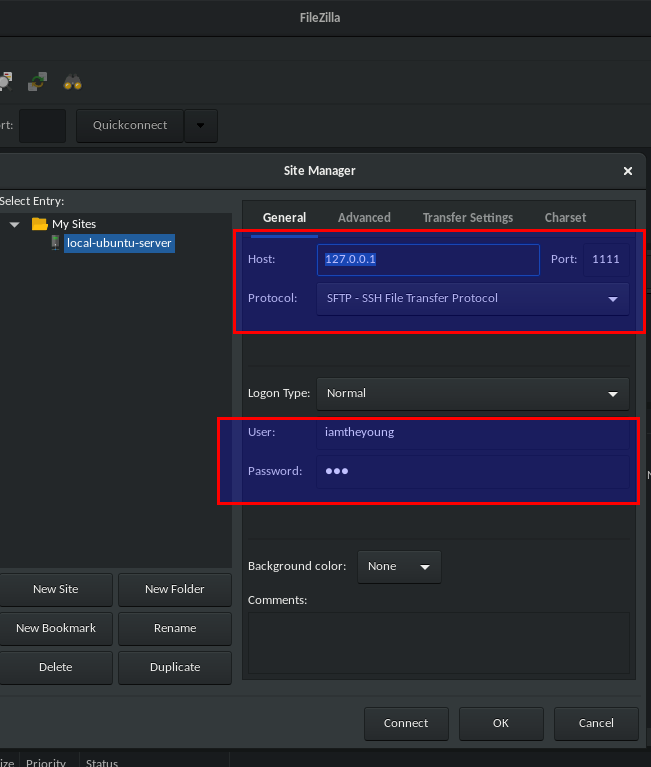
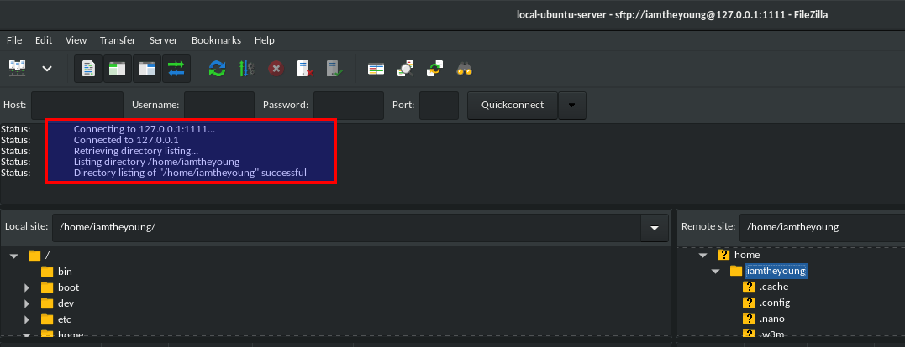

# Basic handler in Headless Mode in VirtualBox

&nbsp;&nbsp;&nbsp;&nbsp;I used to handle with the virtual machines (VMWare / VirtualBox) in GUI no matter what Operating System those come with. The virtual machine instance did rely on plenty of resource on the HOSTs. However, there is one more solution to start the vm-instance that almost doesn't need that much resource. That's <b>Headless Mode</b> in the terminal in VirtualBox.  

+ Using vboxmanage command to start vm-instance and there is no GUI any longer  
```bash
	thinkpad@fedora =>  vboxmanage startvm Virtual_Machine_Name --type headless   // Start in headless type
```  

+ Connect to the vm-instance in SSH  
	- Step 1: Set vm-instance port to host port.  For example: I'm using 1111 to proxy SSH-port in vm-instance.  

		

		  

	- Step 2: Connect to the vm-instance via SSH:  ssh -l username -p 1111 127.0.0.1 

		<p align="center"> 
		 
		 
		
		</p>

		Connect to VM-Instance Successfully.

+ Transfer files between host and vm-instance
	- [FileZila](https://filezilla-project.org/) client.  It is the same with the ssh-connecting.  

		<p align="center">
		
		
		</p>

+ PowerOff the vm-instance  
```bash
	thinkpad@fedora =>  vboxmanage controlvm ubuntu-server poweroff  // PowerOff the instance
```
